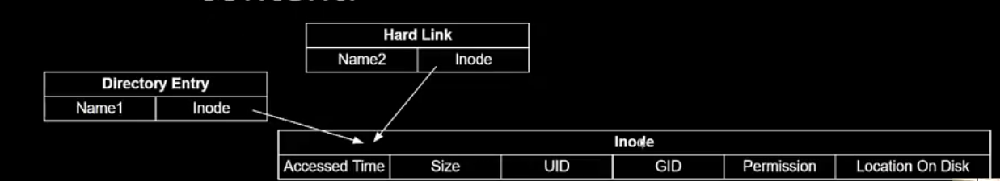
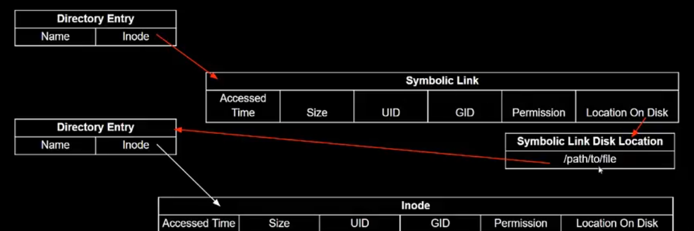

## Course 1: Linux System Programming and Introduction to Buildroot

### Licensing
- **"Permissive"**: BSD (Berkeley Software Distribution), MIT
  - you dont need to share your source code with customers
- "copyleft" - GPL  or gnu public lecense
  - everyone gets access to your source code if it's a derivative work
- LGPL
  - Used for libraries (like gcc libraries)
  - share library modification, not your code, providing your code makes use of an "interface provided by the library"

- GPLv2 vs V3
  - tivo prevented linux modification in hardware
  - GPLv3 specifically prevent this use case
  - Linux kernel is still use GPLv2
  
### System Programming Overview
- System Software - Interfacing with Kernel and C library
- Application Software - Interact with higher-level libs, more OS-abstracted (less direct kernel interaction)
- API
  - Source Code remains portable across different hw, ex printf of c library function
- ABI
  - calling convention, byte ordering
  - defined/implemented by kernel and toolchain

- POSIX
  - C API for unix like os
  - portable operating system interface
  - started by ieee in the late 1980s as a way to coalesce the "unix wars"
  - OSF created the single unix specification (sus), as it is free, and incorporated the posix standard
### Linux Filesystem
- "everything is a file"
- much of the interaction with the kernel occurs via reading/writing files

#### Linux Regular Files
- Linux Inode (index node)
  - Metadata used to track files on disk
  - Includes timestamp, owner, size, mode (access permission), location.
  - Fixed small (128 byte) size
    - filename not included

- Linux Directories
  -  map human readables names to Inode numbers
  -  actually just files (with their own inodes) containing mapping of names to inodes
  -  the directory's own name is stored the same way any filename is: in its parent's dentry table.
  -  start at the root directory "/"

  > why not included filename in Inodes? - allows different file names to share the same content without duplicating Inode content
  - Flexibility of Inode design means multiple names can resolve to the same Inode
  - Links redirect two file/directory paths to same Inode

  - Hard Links map directly to inodes, only allowed on the same filesystems
    - same as directory entry
    - file deletes aren't allowed until all references are deleted (preventing broken hard link)
  - soft link map to filenames, work across filesystems, can be broken
    - Regular file with complete path in content

#### Linux Special Files
- Kernel Objects represented as files
  - char device
    - Linear queue of bytes
    - ex keyboard
  - block device
    - array of bytes, addressable in sector
    - IE Hard Disk
  - named pipes/sockets
    - Inter Process Communication

#### Linux Filesystem Types
- Collection of files in a hierarchy
- Specific types supported, tied to storage types
  - nfs network file storage
  - ext4 block device storage
  - fat microsoft defined storage format for disk
- Mounted/unmounted to add/remove from the root filesystem
- smallest unit addressable is a block
  - block is a power of two multiple of sector size
  - typical/ historical sector size is 512 bytes
> why block/sector because to address each byte require so many bits to address individually

### Process and Threads
- Linux Threads
  - Unit of activity within a process
  - a process may be single threaded or multithreaded
  - each thread has
    - stack 
    - processor state
  - memory address space is shared between threads
- sharing memory access between threads?
  - access directly (use synchronization)
- sharing memory access between processes?
  - use inter process communication (ipc)

#### Linux IPC
- allows process to exchange information without using a common global memory space
  - pipes
  - semaphores
  - message queues
  - shared memory
> All IPC mechanisms use kernel-managed memory ***Process A  →  [ KERNEL SPACE ]  →  Process B***

### User Groups
- Each user is associated with a User ID (uid)
  - each process is associated with the UID of the user running the process/or owner of the process
  - /etc/passwd maps usernames uids
- uid 0 is the root user
- each user belongs to one or more groups, with corresponding group ids
  - /etc/group maps group names to gids

### System Programming and Error Handling
- `errono -l` list types of error
- perror("perror returned") : print last errno description
- stderror(errno)
> errono can be changed between api call so keep storing in local variable
- wouldn't an error in one thread override an error in a second thread?
  - this is handled for us by posix
  > for each thread of a process, the value of errrno shall not be affected by another thread, errno is not a shared global variable. it is stored separately for each thread inside thread-local storage (TLS).

### Toolchains
- compiler
- linker
- run time libraries (help your program work when it runs, it could be link statically or dynamically)
- gcc and clang are the most likely toolchain options

#### GCC toolchain components 
- Binutils - binary utilities including assembler and linker
- gcc compiler for c
- c library - api based on posix definition

#### Setting up a toolchain
- option 1: Do it manually by downloading/building/installing components yourself
- option 2: use a build system to generate (for instance buildroot or yocto)

- Types of toolchain
  - Native toolchain
  - cross toolchain

- specifying toolchain targets
  - aarch64-none-linux-gnu-gcc (for Qemu)
    - cpu is arm 64 bit
    - vendor is none
    - kernel is linux
    - gnu is c library

#### Example Cross Compile Steps
- `aarch64-none-linux--gnu-gcc -g -Wall -c -writer.o writer.c`

#### Sysroot, library and header files
- `aarch64-none-linux-gnu-gcc -print-sysroot`
- sysroot is the root filesystem of your toolchain
- consists of files specific to the *target* type
  - The sysroot has the SAME directory structure as your host’s root (/), but contains files for the TARGET system instead of the host.
- some files are needed to compile programs
- others are (also) needed on the target at runtime
> Why does the toolchain need a sysroot? Because when you compile, the toolchain must act as if it is building the program on the target system, not on your host.

- Sysroot Directories
  - lib - shared objects for c library (on target), dynamic linking files *.so
  - usr/lib -static library archive files for the c library, *.a
  - usr/include - headers for libraries
  - usr/(s)bin: utility programs for the cross toolchain
> sysroot/lib conatains library files specific to the toolchain which will be installed on the target (in the case aarch64) even when built on a different architecture

- other tools in the toolchain
  - aarch64-none-linux-gnu-xxxx)
  - gcc, g++ - compiler
  - gdb -debugger
  - ld-linker
  - addr2line: converts program addresses into filenames/numbers for debug
  - objdump:disassemble objects files
  - strip - remove debug tables, make binary files smaller
  - readelf -additional information about executable (object code, location in memory map, etc)

- static vs dynamic linking
  - gcc, g++ always links with glibs, the c library
  - static linkage
    - when you have relatively few applications (or only a single application), Busybox
    - you need to run an application before the root filesystem is available, at boot , loading storage drivers
  - dynamic linkage

- `make CROSS_COMPILE=aarch64-none-linux-gnu- all` in makefile CC = $(CROSS_COMPILE)gcc

- Shared Library Locations
  - Linker checks for shared libraries
    - /lib, /lib64
    - /usr/lib, /usr/lib64
    - content of LD_LIBRARY_PATH

### Logging and Syslog
- syslog and syslogd
  - syslogd is a daemon which
    - uses configuration file to configure logging (usually writing to files in /var/log)
    - handles log message from applications using syslog() API calls
- API - openlong and syslog
- log redirection in an ubuntu vm happens based on rules in `/etc/rsyslog.d/*default.conf`