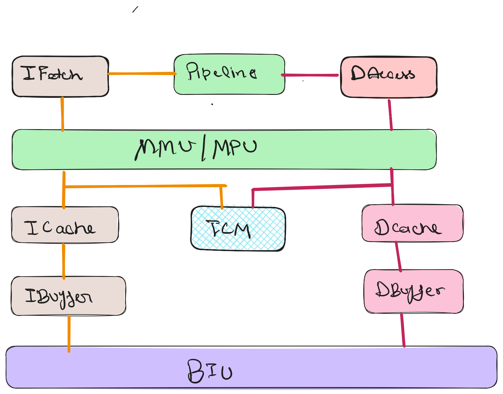
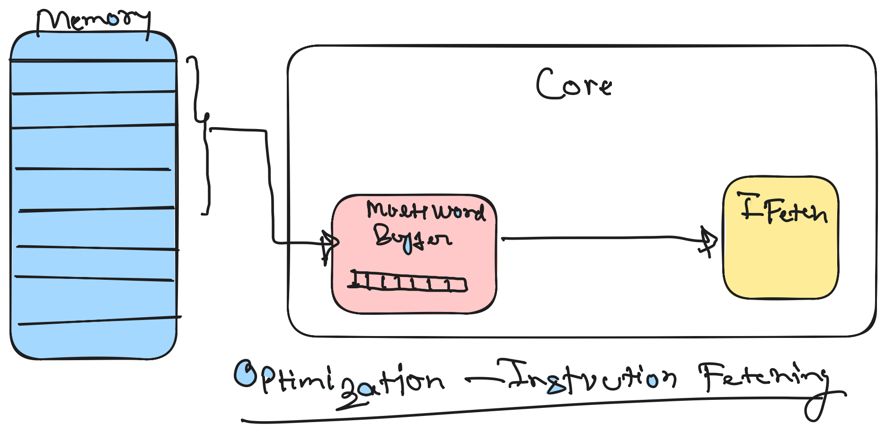
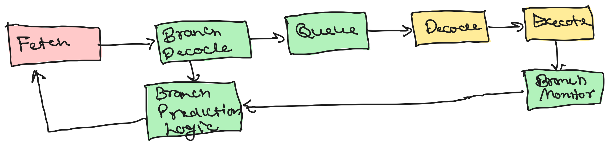
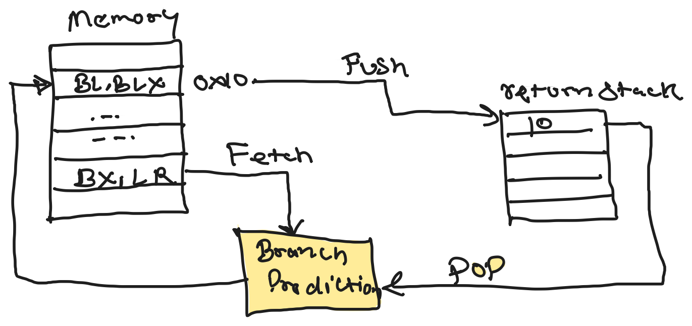

## Arm Cortex Behavior Overview

### Simple Execution Model


### Optimization of Processor
- Piplelining instruction Fetching
- Speculative reads from memory
- Memory access control (will prevent from speculative access outside of the memory defined boundary)


### Instruction Fetching Optimization
- Read multiple Memory add in one go, mostly 8 or 16 word in multiword buffer 



### Branch Prediction Optimization

- Branch Caching
- return stack
- Branch Prediction - history pattern Matches



### Multiple Execution pipelines
- two instruction deocde each cycle and issued
- logically independednt instruction execute simulatneously
- Also can be execute out of order, menas execute earlier than previous instruction completion
    ```
    ADD r1, r2, r3 // both can execute simultaneously
    ADD r4, r5, r6 //
    DIV r1, r4
    MUL r7, r0, r8 // this can execute out order means before the div
    ```

### Speculative Execution
- If an instruction in a speculatively executed branch path requires data from memory, the processor may issue that memory read speculatively — and if the branch is later resolved as not taken, the fetched data is simply discarded.
    >
    > - Branch Prediction    "I think we go left"
    > - Speculative Fetch    "Start reading instructions from the left path"
    > - Speculative Read     "Also start loading data we might need on that path"
    > - Branch Resolves     "Were we right?"  commit or flush
    >


start using some isntruction  befor the result of earlier instruction