# OOPS Design Pattern - Course

## It includes notes from various sources mentioned below.
1. Linkdin Learning - Programming Foundations: Object Orineted Design

## Refernces
* Writing Effective Use Case by Alistair
* UML Distilled by Martin Fowler

## Object Oriented Fundamentals
* Procedural Programming - The Program is written as a long series of operation to execute.
* Object orientantation is referred to as prpgramming paradigm
* Multiple paradigm-Like c++

> Attributes, properties, charatersistics, State, Fields, variables represents same meaning, and can change over lifetime of object.

* All objects have...
  * Identity: - SKD's coffee Mug - One bank account is seaparate from another bank account
  * Attributes: - Color, Size - account no and balance
  * Behaviours: - Fill(), Empty() - deposit and withdraw
  
> **Identity** everyone has separate

* **Objects**
  * Things, places, people, Ideas, Concepts
  * can put "**The**"
* **Behaviour**
  * Menas **verbs**

* **Class Components**
  * Name/Type
  * Attributes /properties or data
  * Behaviour/ Operations

### Four Fundamental Ideas
  * Abstraction - Ex Person, Car(Abstracted what is hidden, engine, transmission)
  * Polymorphism - Having Many Form
  * Encapsulation  
  * Inheritance - Reuse

#### Object Orineted
- Analysis (What do you need to do?)
- Design (How are you going to do it?)
- Programming

### Methododlogies
1. Gather Requirements
2. Describe the application
3. Identify the objects
4. Describe the interaction
5. Create Class Diagram

### UML

#### Structured Diagram
- Class Diagram
- Component Diagram
- Deployment Diagram
- Object Diagram
- Package Diagram
- Profile Diagram

#### Behaviour Diagram
- Use Case Diagram
- Activity Diagram
- State Machine
- Sequence Diagram
- Communication Diagram
- Interaction Overview Diagram

## Requirements

### Requirements (What does it need to do?)
* Functional Requirements
  - What must it do?
* Non- Functional Requirements
  - How should it do it?
    - Legal
    - Performance
    - Support
    - Security

### Functional Requirements
- The system must do...
- The application must do...

**Ex**- Micrwave for space
- heat meals in space packaging
- allow user to set time for meal to be ready

### Non Functional Requirements
- The system should be...
- Describes required **characteristics**  fo the app rather than **features**

**Ex**-
- available 24/7
- usable whilewearing work gloves 
  
### FURSP
* Functionality - Capability, Reusabilty
* Usabilty - Human Factors
* Reliability - Failure Rate
* Performance - Speed
* Supportability - Testility, extensibiltiy
  
### FURSP+
* Design - how it should be built
* Implementation - metholodigies needs to adobt, programming langauge
* Interface - External system that needs to be interfaced with
* Physical - physical constrained where the application will be deployed

## Use Case and User Stories

### Use Case

* Ttile: what is the goal?
* Actor: Who desire it?
* Sucess Scenario:How is it accommplished?
* Extension: Error Handling Scenarios..
* Precondition: 

#### Primary actor and Secondary Actor
* Primary Actor is who initiated the action.

#### Succcess Scenarios:
* Ex- Heat Meal System
  * Cook Meal
  * Genrate reports
  * Chanage setting

* Use Active voice while writng scenarios
  * Ex- Astrnaut inserts meal package

### Use Case Diagram

***EX- space Microwave***
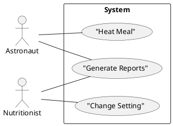

### User Stories

* **As a (type of user)** Ex- As an astrnout, I want to Schedule when I heat my food, so it will be ready later
* **I want (goal)**
* **so that (reason)**

| User Stories                | Use Cases                |
|-----------------------------|--------------------------|
|Short (One index Card)       |Long(a Document)          |
|One goal, no details         |Multiple goals and details|
|Informal                     |casual to (very)formal    |
|Place holder for conversation|Record of conversation    |
## Domain Modelinfg

### Conceptual Model
* Represents important objects and the relationships between them (not software objects)
* To identify objects we will go through all of our use cases and user stories and any other written requirement to pick all of the ***noun***
*  Once the object identify add relationship between them by drawing the line
* Ex- Starship Game- Diagram 

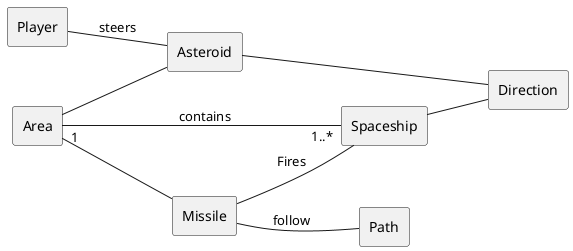

### Identifying Responsibilities
* Look for verb (***Class - behaviours***) phrases in use case, user story or in requirement to identify responsibilities
* Where these responsibilties belongs? Particularly if they affect different objects? ***Rember that an object should be responsible for itself.***
* Ex- Sterring of asteroid, so we should not write the code directly change the inner state of asteroid object, The player should really ask that of the asteroid object.
* Dont create ***God Object/Master Object***, (does too much and know too much), it is similar like procedural program

### CRC Cards
* Class, Reposibilty, Collaboration (CRC) - Template
* Collaboration Means - Other classes it interacts with
* Also call it CRH (Component, Responsibilies, Helper)
* Not write method name as responsibilites,as it is not required at this stage
* Use physical Cards, more handy
  
  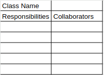 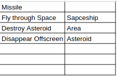

> ***Note:*** Either create CRC Card or Conceptual Diagram, CRC cards has same information of coneptual diagram

## Class Diagram 

### Uml Class Diagram - Ex

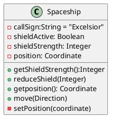

* Static Variable
  * Variable that is shared across all objects in a class
  * Also called a ***shared variable*** or a ***classs variable***

#### Ex- Juke Box Music Player

+ ***Conceptual Model Diagram***
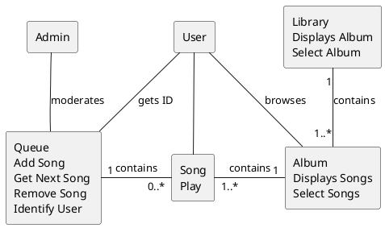

+ ***Class Diagram***
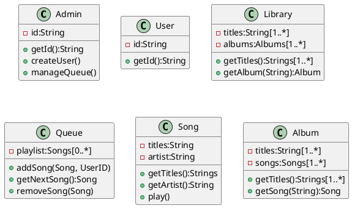

## Inheritance and Composition

### Inheritance
* Inheritance Describes an ***"Is a or type of or kind of*** Relationship
  * A cargoShuttle is a Spaceship
  * A StarFighter is a Spaceship

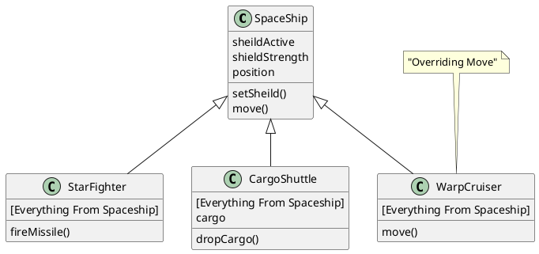

### Abstract Class
  * Exists for other classes to inherit
  * Cannot be instantiated
  * Contains at least one abstract method

### Interface
  * List of methods for a class to implement. It doesnot contain any actual behavior.

>  * Interfaces represets a ***capability***
>  * Abstract classes represent a ***type***
>
> + ***Note:*** interfaces do not suffer from the diamond problem because interfaces are typically implemented using abstract classes with pure virtual functions only, and they do not contain any data members or concrete implementations. This ensures there is no ambiguity caused by shared state or behavior when a class inherits from multiple interfaces.
>
> "***saying:*** Program to an Interface, not to an implementation."

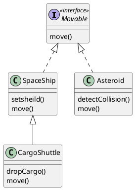

### Aggregation
  * Aggregation Describes a ***"Has a or has many or uses a or uses many"*** Relationship
  * Ex-Fleet has many spaceship

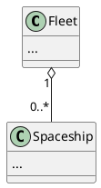
> **Aggregation:** A class contains a reference or pointer to another class, but does not own it. The contained object exists independently.
> **Composition:** A class contains another class and owns it. The contained object is tied to the container’s lifecycle.

### Composition
  * Composition Implies Ownership
  * Ex- A spaceship **owns an** Engine

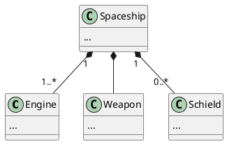
### Ex- Juke Box - Class Relationship Diagram
+ ***Class Diagram***
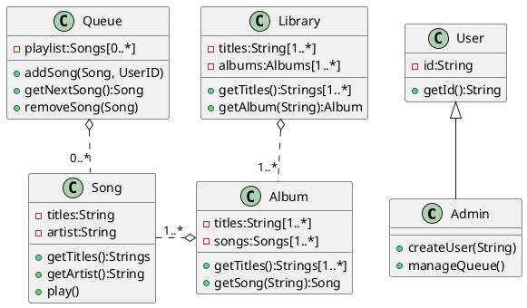

## Software Development

### OOP Support in different language

|Language|Inheritance|Call to Super|Typing|Interfaces|Abstract Classes|
|--------|-----------|-------------|------|----------|----------------|
|Java    | Single    |super        |static|  Yes     |Yes             |
|C#      | Single    |base         |static|  Yes     |Yes             |
|Python  | Multiple  |super        |dynamic|Abstract Class|Yes        |
|Swift   | Single    |super        |static|Protocols |No              |
|C++     | Multiple  |name of class::|static|Abstract Class|Yes       |
|Ruby    | Mixins    |super        |dynamic|  n/a    |n/a             |
|JScript | Prototypes|n/a          |dynamic| n/a     |n/a             |

> **Note:** Most compiled languages are statically typed, meaning the type of variables are known at compile time. THis menas, as a developer, you have to specify the type of variable uyou declare.

### Design Pattern 
* The re-usbale form of a solution to a design problem

#### Types of Design Pattern
* **Creational Patterns**
(About the instantiation of objects. These patterns provide ways to create objects while hiding the instantiation logic and ensuring flexibility in object creation.)
  * Abstract Factory
  * Builder
  * Factory Method
  * Prototype
  * Singleton

* **Structural Patterns**
(concerned with how classes and objects are composed to form larger structures. These patterns simplify relationships between entities.- inhertance, aggregation and composition)
  * Adapter
  * Bridge
  * Composite
  * Decorator
  * Facade
  * Flyweight
  * Proxy

* **Behavioral Patterns**
(Focus on communication and responsibility between objects at runtime. These patterns deal with dynamic interactions between objects.)
  * Chain of responsibility
  * Command
  * Interpreter
  * Iterator
  * Mediator
  * Memento
  * Observer
  * State
  * Strategy
  * Template Method
  * Visitor
