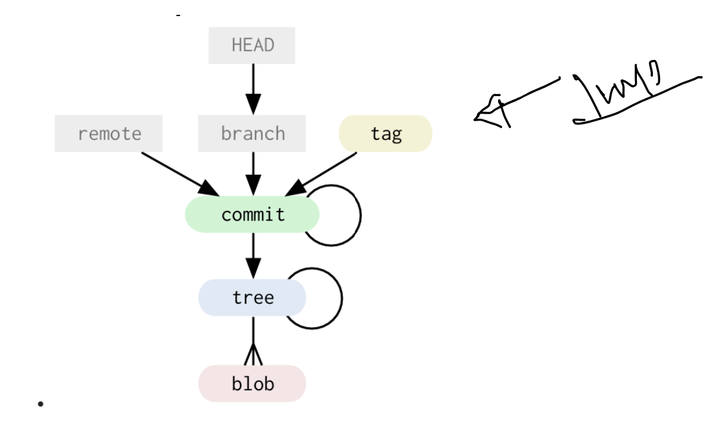
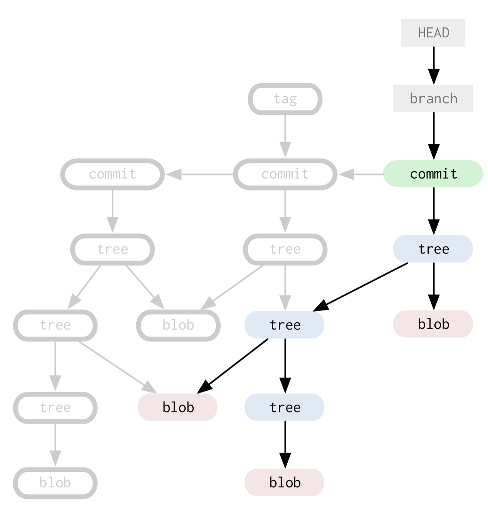
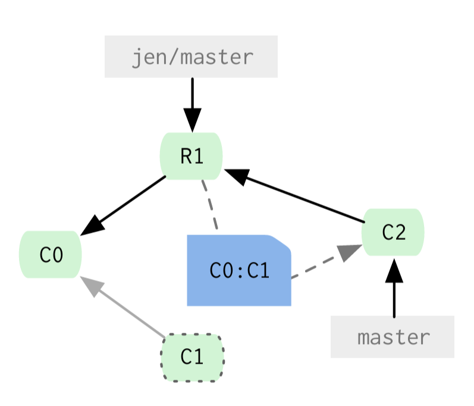
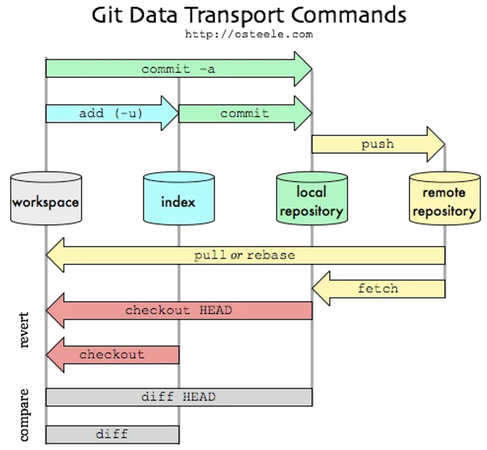

# Git Notes

## References
- *Git Workflows* by Yan Pritzker  
- *Git Internals: Source Code Control and Beyond* by Scott Chacon  
> These are personal study notes.  
> Diagrams are taken from the above sources. Not for redistribution.

## Introduction
- Git stores a new version of project, it stores a new tree - a bunch of blobs of content and a collection of pointers that can be expanded back out into a full directory of files and subdirectories
- Git is less a program and more a toolkit

## Git Object Types
- Objects are stored in the Git Object Database which is kept in the Git Directory. Each object is compressed and referenced by the SHA-1 value of its contents plus a small header.
- There are four types of objects:

### The Blob
- Contents of files are stored as *blobs*
- Same two files in project, git will only store the blob once and expand to files once checkout
- The names and modes of the files are not stored with blob, just the contents

### The Tree
- Directories in Git basically correspond to **trees**
- A tree is a simple list of trees and blobs that the tree contains, along with the names and modes of those trees and blobs
- The contents section of a tree object consists of a very simple text that lists the mode, type, name and SHA of each entry

### The Commit
- The commit is like the tree. It simply points to a tree and keeps an author, committer, message and any parent commits that directly preceded it.

### The Tag
- This is an object that provides a permanent shorthand name for a particular commit
- The type is commit and the object is the SHA-1 of the commit you are tagging.

## The Git Data Model
> All commit objects point to a tree and optionally to previous commits. All trees point to one or many blobs and/or trees.

### References
- Git objects are immutable, that is they cannot ever be changed.
- There are references also stored in git. Unlike the objects, references can constantly change. They are simple pointers to a particular commit.
- Branches and remotes are references.
- To branch that line of development, all git does is create a new file in that direction (.git/refs/heads/) that points to the same SHA-1.

### The Model
- The current branch points to our last commit and the HEAD file points to the branch we are currently on.


### Branching and Merging
- Creating a branch is nothing more than just writing 40 characters to a file.
- `git checkout -b new-branch` Creates a new branch, moves HEAD to it immediately.
- Updating the HEAD file so each commit from that point on moves that branch pointer forward (in other words, it changes the 40 characters in .git/refs/heads/[current_branch_name] to be the SHA-1 of your last commit).


### Remotes
- Remotes are basically pointers to branches in other people's copies of the same repository.
- When you clone a repository, Git automatically adds a remote named origin, and the branch you initially check out (usually main or master) is set to track the corresponding remote branch (e.g., origin/main) by default.
- Create a new tracking branch from a remote branch `git checkout -b main origin/main` Creates main and sets it to track origin/main.
- `git remote -v`: list all remote connections your local repo knows about
#### Use cases
- You're working on the dev branch. Another developer (Emma) has a fix in her repository. You want to test it safely before merging.
- Add Remote & Fetch
```bash
git remote add emma https://git-provider.com/emma/project-name.git
git fetch emma
```
- Create Test Branch
```bash
git checkout dev
git checkout -b try-emma-fix
```

- Merge Emma's Fix
```bash
git merge emma/fix-feature-branch
```
- If it works
```bash
git checkout dev
git merge try-emma-fix
git branch -d try-emma-fix
```
> `git reflog` tracks HEAD movement (super useful for recovery)

### Rebasing
- Rebase will literally produce a series of patch files of your work and start applying them to upstream branch, automatically making new commits with the same message as before and orphaning your older ones.
- As mentioned below diagram, we have our first merge and we can see that it orphans commit 1 and applies the changes between commit 0 and 1 to the files in remote commit 1, creating a new commit 2.


### Examples

```
Fast-Forward Merge (Cleanest & Preferred)

A---B---C        (master)
         \
          D---E  (origin/master)

git merge --ff-only origin/master

A---B---C---D---E  (master, origin/master)

Merge Commit (The "Spaghetti" Case)
A---B---C---X   (master)
         \
          D---E (origin/master)

git merge origin/master

A---B---C---X----M  (master)
         \        /
          D---E---

Rebase Instead of Merge (Professional Workflow)

A---B---C---X   (master)
         \
          D---E (origin/master)
git fetch origin
git rebase origin/master

A---B---C---D---E---X'  (master)

git pull            fetch + merge
git pull --rebase   fetch + rebase
git pull --ff-only  fetch + ff-merge
```

- Step 1: Create the Long-Term Branch, You isolate your work so you don't break the current production site.
- Step 2: Continuous Rebasing (The "Maintenance" Phase), Every few days, you need to bring in the new work your teammates have finished on master. Instead of merging (which creates a messy "spaghetti" history), you rebase.

```bash
git checkout master
git pull origin master          # Get the latest team updates
git checkout refactor-db-layer
git rebase master               # "Lift" your work and put it on top of the new master
```

```
A---B---C        (master, origin/main)
         \
          D---E  (refactor-db-layer)
git checkout master
git pull origin master (this is fast forward)

A---B---C---F---G   (master, origin/master)
 \
  D---E     (refactor-db-layer)
git checkout refactor-db-layer
git rebase master
A---B---C---F---G   (master)
                 \
                  D'---E'   (refactor-db-layer)
```

```
A---B---C        (master)
         \
          D---E  (dev)

Merge dev → master

git checkout master
git merge dev
A---B---C---------M   (master)
 \       /
  D---E       (dev)

Merge master → dev

git checkout dev
git merge master

nothing change
```

- Fast-Forward Example

```
A---B---C---D---E   (master)
         ^
         |
        (dev)
git checkout dev
git merge master

A---B---C---D---E   (master, dev)


A---B---C---D---E   (master)
         ^
         |
        (dev)
git checkout master
git merge dev

nothing change, Already up to date.
```

- Git checkout scenarios
```bash
git checkout <branch> → move HEAD to that branch
git checkout -b <branch> → create + move HEAD
git checkout <commit> → move HEAD to commit (detached)
```

### The Treeish
- Any git command that takes an object - be it a commit, tree or blob - as an argument can take one of these shorthand versions as well.
  - Partial SHA-1
  - Branch or tag name
  - Date spec `master@{yesterday}`
  - 5th prior value of master branch `master@{5}`
  - Caret parent `master^2` or `ee6546^2`, nth parent of that commit, only helpful for commits that merged two or more commits
  - Tilde spec `e65s46~5` nth generation grandparent of that commit, similar to e6546s^^^^^
  - Tree pointer `e65s46^{tree}` this points to the tree of that commit
  - Blob spec - master:/path/to/file, referring to a blob under a particular commit or tree

## The Git Directory
- Git directory does not need to be in your source tree at all. Keep it anywhere, just set the GIT_DIR variable when switching to projects.
- `.git/config` project specific git options and configuration
- `.git/index` default location of index file
- `.git/objects/` holds the data of your Git objects
- `.git/refs/` This directory normally has three subdirectories in it - heads, remotes and tags. Each of these directories will hold files that correspond to your local branches, remote branches and tags, respectively.
- `.git/HEAD` This file holds a reference to the branch you are currently on. This basically tells Git what to use as the parent of your next commit.
- `.git/hooks` contains shell scripts which are invoked after the git command

## The Index
- The index was called the cache for a while, because that's largely what it does. It is a staging area for changes that are made to files or trees that are not committed to your repository yet.

## Using Git
```bash
git config --global user.name "Scott Chacon"
git config --global user.email "schacon@gmail.com"
git init
git add . git commit -m 'my first commit'

git clone git://github.com/schacon/simplegit.git <optional directory name>
git commit -a # add and commit both
git add -i # interactive adding
git log --pretty=oneline
git ls-tree master^{tree} #List all files and directories in the latest commit of the master branch
git show master^ # Show me the parent (previous commit) of the master branch
git ls-tree -r -t master^{tree} # see all sub trees as well, -t makes it also show the sha1 of subtrees
git cat-file -t ae850bd698b2b5dfbac #extract the contents of individual blobs
gitk --all
git instaweb --httpd=webrick
git instaweb --stop
git diff --staged
git diff HEAD
git diff abc123 def456
git format-patch -1 HEAD
git format-patch -3
git am 0001-fix-bug.patch
git diff > changes.patch
git apply changes.patch
# undo a merge
git merge --abort
git reset --hard HEAD~1
git revert -m 1 <merge_commit_hash>
```

## Rebasing
- Instead of running 'git merge story84' from the master branch, we can stay in the 'story84' branch and run 'git rebase master'
  - Then all we have to do is switch to the master branch and merge in 'story84' (which is called a 'fast-forward', since 'master' is now a direct ancestor of 'story84') to get this:

## Stashing
- `git stash`, `git stash list`, `git stash show stash@{1}`, `git stash apply`

## Tagging
- `git tag -a v0.1 -m 'this is my v0.1 tag'`

### Lightweight Tags
- `git tag v0.1` Git will create the same file as before, '.git/refs/tags/v0.1', but it will contain the SHA-1 of the current HEAD commit itself, not the SHA-1 of a Tag object pointing to that commit.

## Exporting Git
- `git-archive --prefix=simplegit/ v0.1 | gzip > simple-git0.1.tgz`
- `git-archive --format=zip master^ lib/ > simple-git-lib.zip`

## Care and Feeding of Git
- `git gc`
- `git fsck`
- `git prune`

## Git Workflow


### Git Bash Completion and Show Branch in Bash Prompt
- `git-completion.bash` download, add the path in ~/.bashrc
- `export PS1='\[\033[01;34m\]\u:\[\033[01;32m\]\w\[\033[00;34m\]\[\033[01;32m\]\[\033[00m\] \[\033[01;33m\]$(__git_ps1)$ \[\033[00;37m\]'`

### Unstage and Uncommit
- `unstage = reset HEAD` opposite to `git add .`, another command new `git restore --staged <file>`
- `uncommit = reset --soft HEAD^` put the change in index

### Keeping Your Changes Clean
- To add the deletion to the index, `git add -A` or `git rm` to delete the file
- `git add --patch` - interactive prompt to stage and unstage the changes
- `git diff --cache` : diff between staging area and last commit
- `git diff` : diff with unstaged area
- `git merge --squash bug123` and delete the branch `git branch -D bug123`
- `git branch -v` see available branches

### Stash to Temporarily Hide Your Changes
- `git stash` `git stash pop` and `git stash apply`
- Another good use of the stash is for moving the uncommitted changes between branches

### Rebase
- `git rebase -i HEAD~[N]` edit last N commits, example: squash, edit etc

### Time Travel
- `git log -p -S"object_string"`
- `git log -p --grep="commit message string"`
- `git checkout -f` throw away all changes, similar to `git reset --hard HEAD`
- `git checkout README` or `git checkout <commit> README`
- `git revert <commit>`

#### Reverting the Change of One File
```bash
git log filename
git revert -n [hash] # revert and not commit and keep the files in index
git reset HEAD # or git restore --staged .
git add filename
git commit -m "reverting change to file"
```

### Using Git Remotes for Collaboration
- Create a new project, and follow GitHub's instructions for pushing your changes out to your newly created repo.
```bash
git init
git add .
git commit -m "first commit"
git remote add origin git@github.com:[user-name]/[repo-name].git
git push -u origin main
```
- `git push origin master` This command tells git to push all the changes you've made on your master branch, to the master branch on the remote called origin.
- `git push origin foobar:master` If you wanted to call your local branch foobar instead, you could use this syntax.
- `git push` convenience. If you name all your local branches identically to your remotes, then you can just use this. This will push out changes on all branches that have matching branches on the remote end.

- Create branch on remote
  - `git checkout -b [branch name]`
  - `git push -u origin [branch name]`
- Deleting a remote branch
  - `git branch -D [branch name]`
  - `git push origin :[branch name]`
- `git branch -av` show all branches including remote ones
> Note that the branches listed as "origin/[branchname]" are called remote tracking branches.

- `git checkout origin/master` will give warning "You are in 'detached HEAD' state.", So in order to actually work with the remote branch, we'll need a local tracking branch set up to track the remote branch in question: `git checkout -b bug123 origin/bug123`

- You can grab his changes, and replay your changes on top by using the same rebase technique:
```bash
git fetch origin
git rebase origin/bug123
# or directly
git pull --rebase origin bug123
```

### Outside Contributor Collaboration Workflow
- While Emma and James work together by directly committing to the GitHub repo, they outsource part of their project to contributor Luke. Emma is the project leader, so she takes on the primary task of reviewing Luke's work, and merging it into the main repository.

- Once Luke has his fork, he follows the instructions provided by GitHub to clone the fork on his local machine, which looks something like this:
```bash
git clone git@github.com:luke/some-project.git
```

- Luke now has an origin which refers to his own project on GitHub. But he's going to occasionally want to sync up to the official repo owned by CoreStack, Inc, so he'll add a remote for the original repo, as well:
```bash
git remote add corestack git@github.com:corestack/some-project.git
```
- To track Luke's progress, Emma sets up a remote link to Luke's repo:
```bash
git remote add luke git@github.com:luke/some-project.git
git fetch luke
```
- By using the techniques from the beginning of the chapter to create local tracking branches for contributing to Luke's work:
```bash
git branch bug123 luke/bug123 # hack, hack, hack - helping luke out
git commit -a -m "code review and fixing to help Luke"
git push luke bug123
# once the bug is done, put it into master
git checkout master git merge --squash luke bug123
git commit -m "Bug #123 - fix something" --author "Luke"
git push
```
- Luke keeps himself in sync to the official master branch by using pull --rebase:
```bash
git checkout master
git pull --rebase corestack master
```
- If Luke does all his work on branches and never touches his master, another equivalent way, but perhaps slightly safer (avoiding any rebase troubles), is to reset to point to the master:
```bash
git checkout master
git fetch corestack
git reset --hard corestack/master
```

- Cleaning up stale remote tracking branches `git remote prune origin`
- Create and push tags
```bash
grb create 1.0
git push
git tag tag-1.0
git push --tags
```
- `git cherry-pick -x master` - applies the latest commit from the master branch onto your current branch.

### Generating Release Changelogs
```bash
git changelog tag-1.0..master
git merge-base 1.0 master  # The merge-base command will give you the last commit which is shared by two branches:
git changelog [commit obtained from merge-base]..master
```
